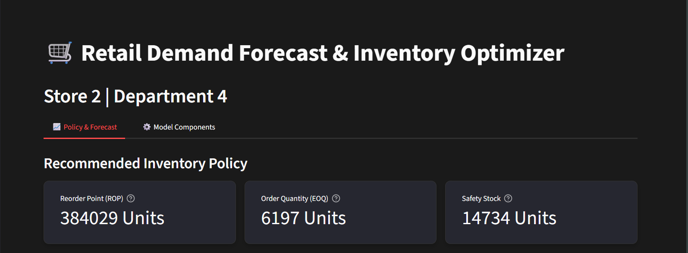
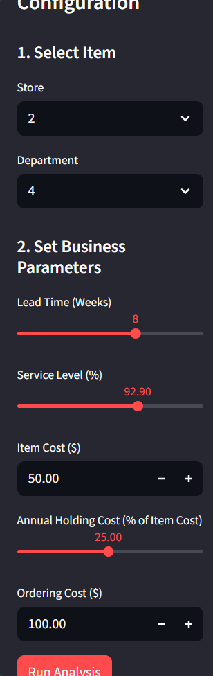

# walmart-inventory-optimizer
# 🛒 Retail Demand Forecast & Inventory Optimizer

This is an end-to-end analytics tool that moves from prediction (forecasting sales) to prescription (optimizing inventory). It's built in Python using Prophet and Streamlit.

## 🚀 Live Application

**[Link to your deployed Streamlit app will go here once it's live]**

## 💡 The Business Problem

Retail clients constantly struggle to balance the high cost of overstocking with the lost sales from stockouts. This tool provides a data-driven solution by answering two key questions:
1.  **When** should we reorder?
2.  **How much** should we reorder?

## 🛠️ How It Works

1.  **Forecast:** A time-series model (Prophet) forecasts weekly sales, capturing seasonality and the impact of external drivers like temperature and holidays.
2.  **Optimize:** The forecast's uncertainty is used to calculate a full inventory policy (Reorder Point, Safety Stock, EOQ) that is optimized to meet a specific **Service Level**.
3.  **Deploy:** The entire model is deployed as an interactive Streamlit dashboard where a "store manager" can run what-if scenarios to see the exact cost/risk trade-offs of their decisions.




## 🔧 How to Run Locally

1.  **Clone the repository:**
    ```bash
    git clone [https://github.com/diyagijo/walmart-inventory-optimizer.git](https://github.com/diyagijo/walmart-inventory-optimizer.git)
    cd walmart-inventory-optimizer
    ```
2.  **Create and activate a virtual environment:**
    ```bash
    python -m venv venv
    .\venv\Scripts\activate
    ```
3.  **Install dependencies:**
    ```bash
    pip install -r requirements.txt
    ```
4.  **Run the app:**
    ```bash
    streamlit run app.py
    ```

---
*(Note: The full `train.csv` (420MB) is not included. A sample of the data is used in the `data/` folder for demonstration.)*


    
